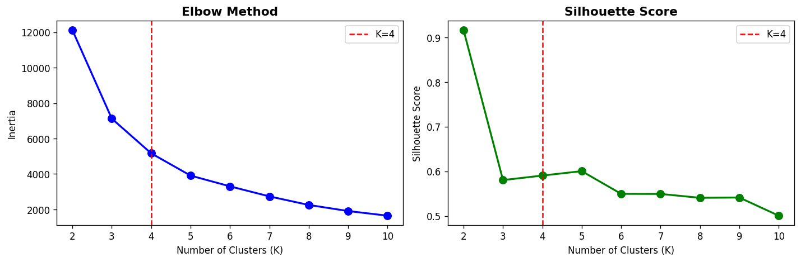
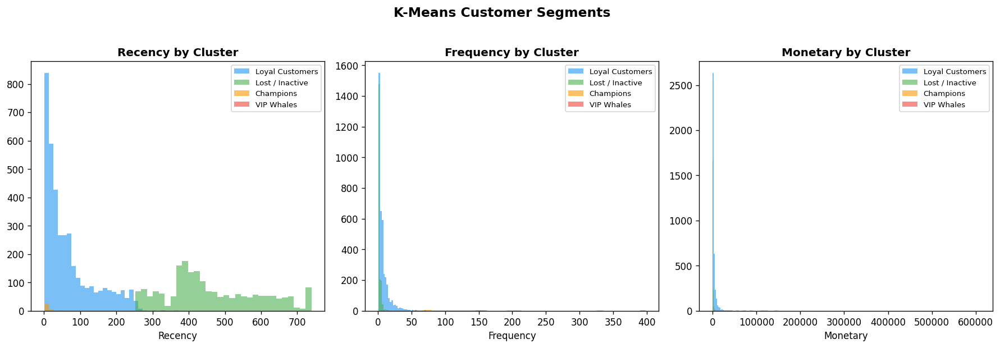
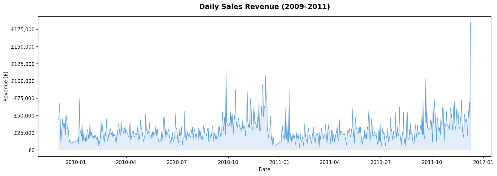
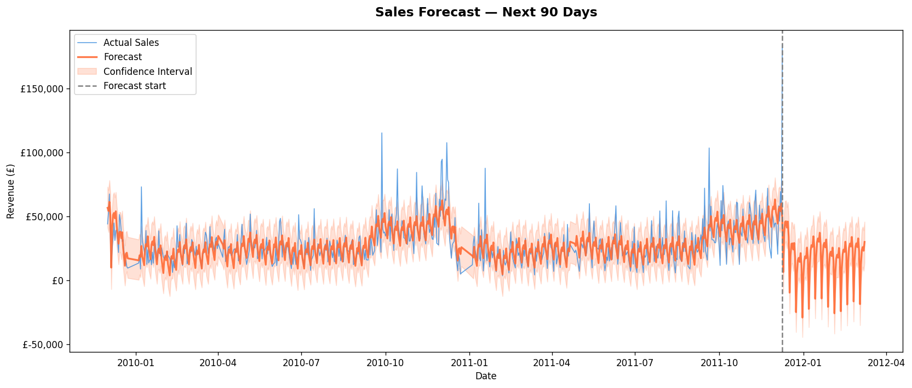
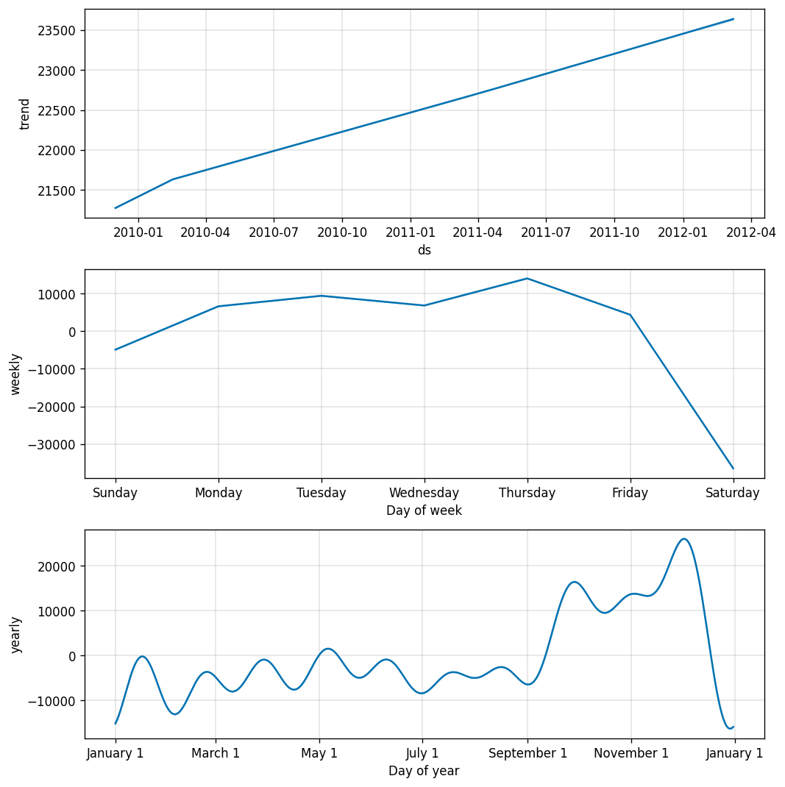
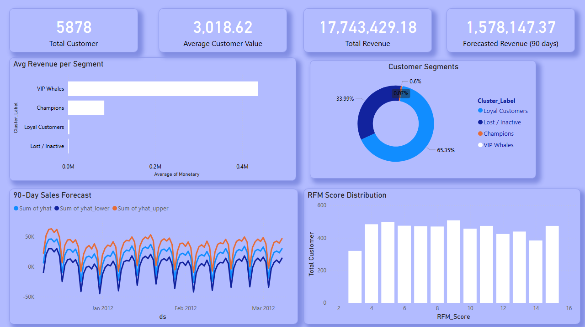

# Customer Segmentation & Sales Forecasting

An end-to-end data analytics and machine learning project analyzing 1M+ e-commerce transactions from a UK-based online retailer. This project covers SQL analysis, RFM customer scoring, K-Means clustering, and Prophet sales forecasting — all visualized in an interactive Power BI dashboard.

---

## Project Overview

| Detail | Info |
|---|---|
| Dataset | Online Retail II UCI (1,067,371 rows × 8 columns) |
| Period | December 2009 – December 2011 |
| Tools | Python, Pandas, Scikit-learn, Prophet, Power BI, SQLite |
| Environment | Kaggle Notebooks |
| ML Techniques | K-Means Clustering, Time Series Forecasting |

---

## Key Business Insights

1. **4 distinct customer segments identified** — K-Means clustering revealed Champions (35 customers), Loyal Customers (3,841), Lost/Inactive (1,998), and 4 Ultra VIP Whales averaging £436K each in lifetime spend.

2. **4 VIP Whale customers drive disproportionate revenue** — Just 4 customers (0.07% of base) placed 212+ orders each and averaged £436,835 in spend. Losing even one would significantly impact the business.

3. **Thursday is peak trading day, Saturday near zero** — Weekly seasonality analysis confirmed this is a B2B wholesale business. Operators should schedule promotions and stock replenishment mid-week.

4. **65% of customers are Loyal, 34% are Lost/Inactive** — Over a third of the customer base hasn't purchased recently. A targeted re-engagement campaign could recover significant revenue.

5. **Revenue is growing consistently** — Trend analysis shows daily average revenue grew from £21,500 to £23,500 between 2010 and 2011, confirming healthy year-over-year business growth.

6. **90-day revenue forecast: £1,578,147** — Prophet model predicts £1.58M in the next 90 days (best case: £3.03M, worst case: £132K). Wide confidence interval reflects post-holiday uncertainty.

7. **Q4 November spike consistent across all years** — Yearly seasonality confirms November is always the strongest month. Inventory and staffing should be scaled up from October.

---

## Project Architecture

```
Customer Segmentation & Sales Forecasting
│
├── Day 1 — SQL Analysis
│   ├── Load & merge 1M+ rows from two-year dataset
│   ├── Clean: remove cancellations, nulls, bad values
│   └── SQL queries: revenue summary, top customers, country breakdown
│
├── Day 2 — RFM Analysis
│   ├── Calculate Recency, Frequency, Monetary per customer
│   ├── Score each customer 1–5 on all 3 dimensions
│   └── Label 7 business segments (Champions → Lost)
│
├── Day 3 — K-Means Clustering (ML)
│   ├── Scale features with StandardScaler
│   ├── Find optimal K using Elbow method + Silhouette score
│   └── Assign business labels to 4 discovered clusters
│
├── Day 4 — Sales Forecasting (ML)
│   ├── Aggregate daily revenue time series
│   ├── Train Facebook Prophet model
│   └── Predict next 90 days with confidence intervals
│
└── Day 5 — Power BI Dashboard
    ├── 4 KPI cards: Revenue, Customers, Avg Value, Forecast
    ├── Customer segment donut chart
    ├── Avg revenue by segment bar chart
    ├── 90-day forecast line chart
    └── RFM score distribution column chart
```

---

## Machine Learning Models

### K-Means Clustering
- **Algorithm:** K-Means (Scikit-learn)
- **Features:** Recency, Frequency, Monetary (StandardScaler normalized)
- **Optimal K:** 4 (determined via Elbow method + Silhouette score)
- **Result:** 4 distinct customer segments discovered

| Cluster | Label | Customers | Avg Recency | Avg Orders | Avg Spend |
|---|---|---|---|---|---|
| 0 | Lost / Inactive | 1,998 | 463 days | 2.2 | £765 |
| 1 | Loyal Customers | 3,841 | 67 days | 7.3 | £3,009 |
| 2 | Champions | 35 | 26 days | 103.7 | £83,086 |
| 3 | VIP Whales | 4 | 4 days | 212.5 | £436,836 |

### Sales Forecasting (Prophet)
- **Algorithm:** Facebook Prophet
- **Input:** Daily aggregated revenue (2009–2011)
- **Seasonality:** Yearly + Weekly (daily disabled)
- **Forecast horizon:** 90 days

| Scenario | Predicted Revenue |
|---|---|
| Expected | £1,578,147 |
| Best Case | £3,029,012 |
| Worst Case | £132,407 |

---

## Python Visualizations

### Elbow Method — Optimal K Selection


### K-Means Cluster Distribution


### Daily Sales History (2009–2011)


### 90-Day Sales Forecast


### Forecast Components (Trend + Weekly + Yearly)


---

## Power BI Dashboard



**Dashboard features:**
- 4 KPI cards including ML-powered revenue forecast
- Customer segment donut chart (4 clusters)
- Average revenue per segment bar chart
- Interactive 90-day forecast with confidence intervals
- RFM score distribution showing customer quality spread

---

## Project Structure

```
customer-segmentation-forecasting/
│
├── customer_segmentation.ipynb     # Main Kaggle notebook
├── README.md
│
├── data/
│   ├── retail_cleaned.csv          # Cleaned transaction data (805K rows)
│   ├── rfm_scores.csv              # RFM scores per customer
│   ├── rfm_clustered.csv           # RFM + K-Means cluster labels
│   └── sales_forecast.csv          # Prophet forecast output
│
├── dashboard/
│   └── Customer_Segmentation_Dashboard.pbix
│
└── charts/
    ├── elbow_chart.png
    ├── cluster_distribution.png
    ├── daily_sales_history.png
    ├── sales_forecast.png
    ├── forecast_components.png
    └── dashboard.png
```

---

## How to Run

1. Open `customer_segmentation.ipynb` on Kaggle
2. Add dataset: **Online Retail II UCI** via Kaggle Datasets
3. Run all cells in order (Day 1 → Day 5)
4. Download output CSVs from `/kaggle/working/`
5. Open `Customer_Segmentation_Dashboard.pbix` in Power BI Desktop

---

## Dataset

- **Source:** [Online Retail II UCI — Kaggle](https://www.kaggle.com/datasets/mashlyn/online-retail-ii-uci)
- **Original Source:** UCI Machine Learning Repository
- **Records:** 1,067,371 transactions (805,549 after cleaning)
- **Country:** United Kingdom (83% of revenue)
- **Business Type:** B2B wholesale e-commerce

---

## Tools & Technologies

- **Python 3** — Pandas, NumPy, Matplotlib, Seaborn
- **Machine Learning** — Scikit-learn (K-Means), Facebook Prophet
- **Database** — SQLite3 (in-memory SQL queries)
- **BI Tool** — Power BI Desktop (DAX measures)
- **Environment** — Kaggle Notebooks
- **Version Control** — GitHub

---

## Skills Demonstrated

`Data Cleaning` `Exploratory Data Analysis` `SQL` `RFM Analysis`
`K-Means Clustering` `Unsupervised Machine Learning` `Time Series Forecasting`
`Feature Scaling` `Business Intelligence` `Power BI` `DAX` `Data Storytelling`

